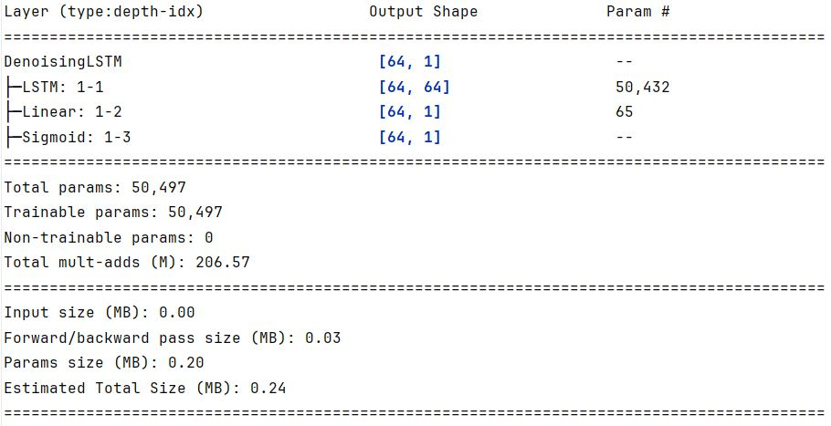
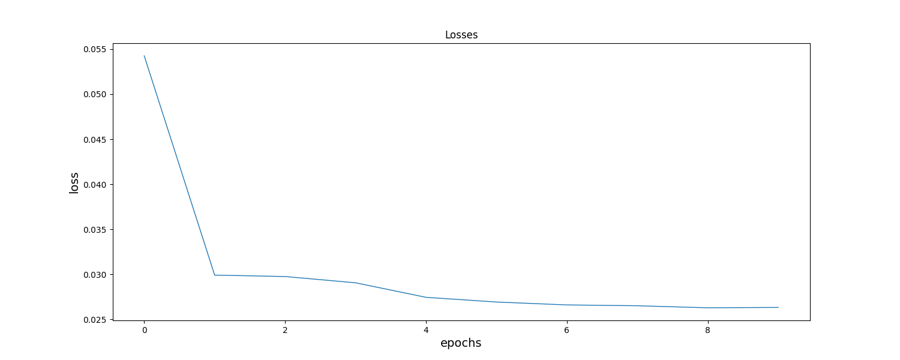
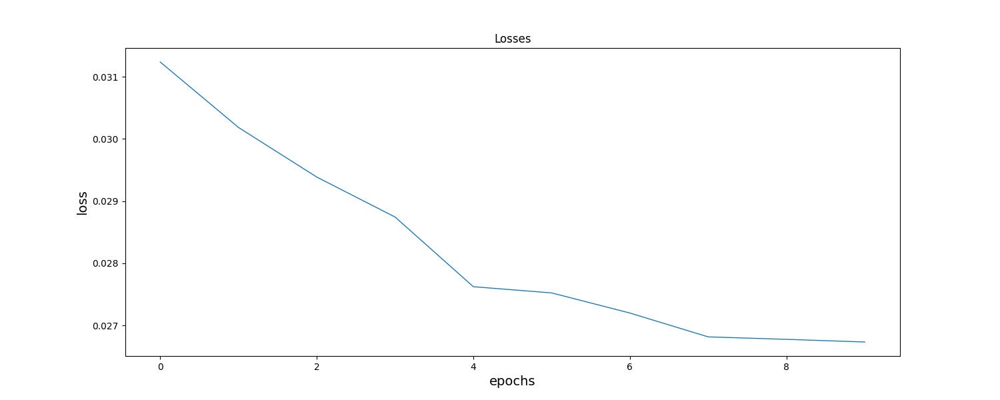
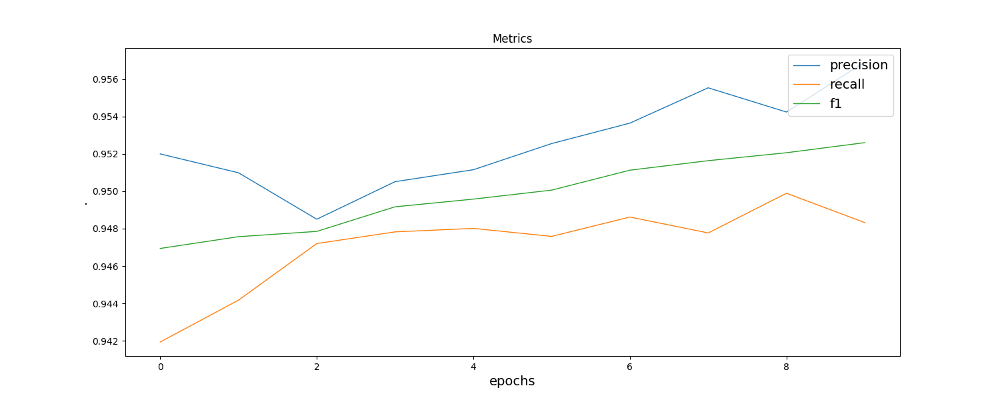
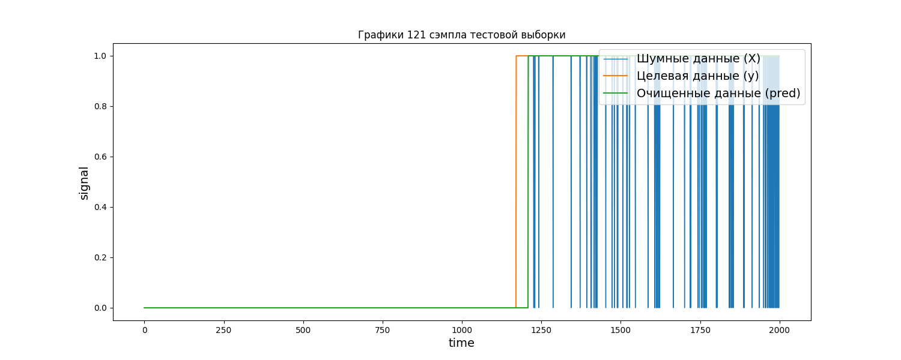
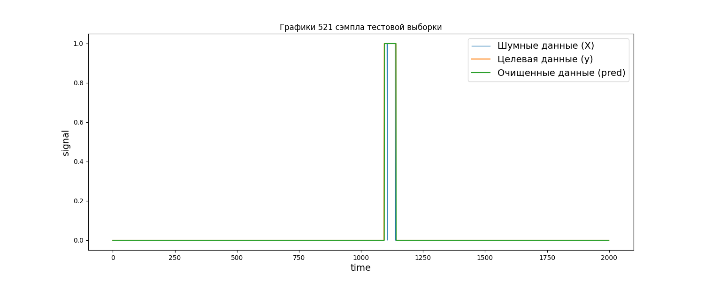
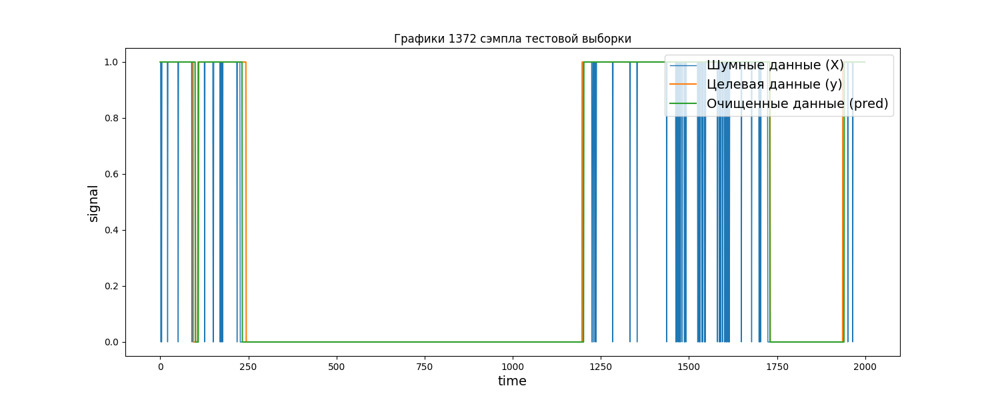
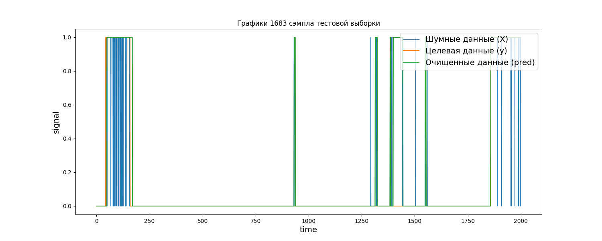
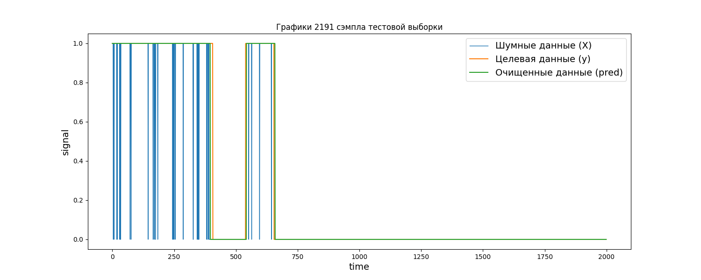
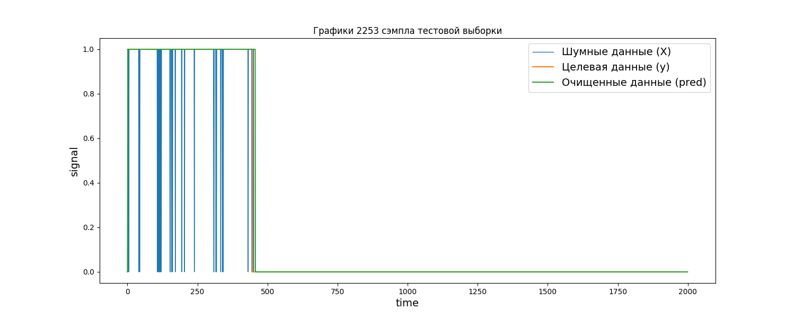

# Нейросетевой фильтр сигнала

## Введение
Пакет предназначен для обучения нейронной сети фильтрации временного ряда. Реализованы алгоритмы: сбора и парсинга данных
датасетов формата `.pt`, обучения рекуррентной нейронной сети, тестирования ее на заранее заготовленных тестовых данных с
последующей визуализацией фильтрации и графиков метрик. Использован фреймворк машинного обучения `pytorch`.

## Архитектура нейронной сети
Для обучения используется простая архитектура рекуррентной нейронной сети со stacked-LSTM слоем, полносвязным слоем и сигмоидальной функцией.

## Графики потерь
На графиках ниже изображены потери обучения и валидации за 10 эпох.  

 
 

## Графики метрик
На графике ниже изображены метрики (precision, recall, f1-score), рассчитываемые на тестовой выборке в процессе 
обучения за 10 эпох.  

 

## Пример фильтрации
На изображениях ниже показаны примеры фильтрации разных временных участков тестовой выборки.
> Примечание! Графики могут накладываться друг на друга и скрывать друг друга, если они идентичны. 
> Тем не менее, график, отфильтрованных нейронной сетью данных, находится поверх остальных.  

| Пример                          |
|---------------------------------|
|   |
|   |
|  |
|  |
|  |
|  |
